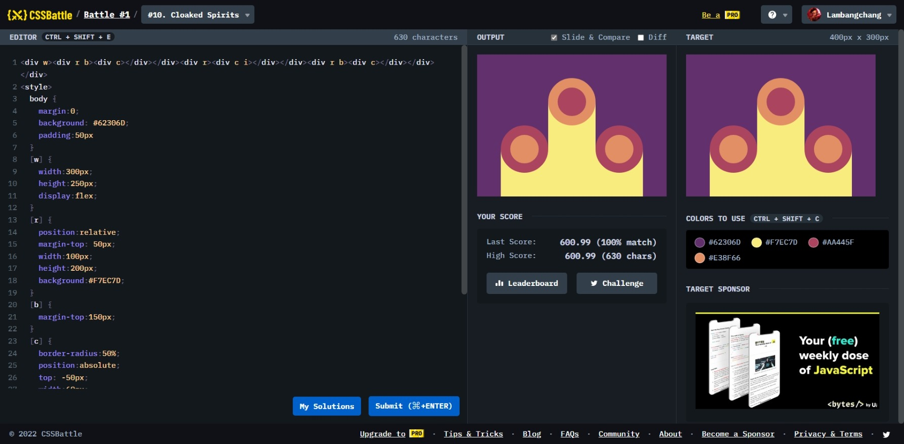

# Cloaked Spirits



```html
<div w>
  <div r b><div c></div></div>
  <div r><div c i></div></div>
  <div r b><div c></div></div>
</div>
<style>
  body {
    margin: 0;
    background: #62306d;
    padding: 50px;
  }
  [w] {
    width: 300px;
    height: 250px;
    display: flex;
  }
  [r] {
    position: relative;
    margin-top: 50px;
    width: 100px;
    height: 200px;
    background: #f7ec7d;
  }
  [b] {
    margin-top: 150px;
  }
  [c] {
    border-radius: 50%;
    position: absolute;
    top: -50px;
    width: 60px;
    height: 60px;
    border: 20px solid #aa445f;
    background: #e38f66;
  }
  [i] {
    border: 20px solid #e38f66;
    background: #aa445f;
  }
</style>
```
