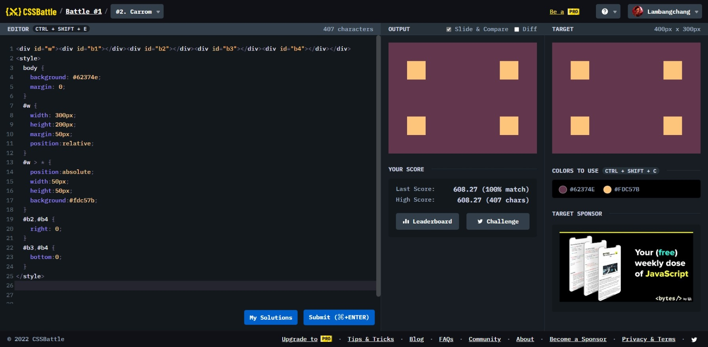

```html
<div tr></div><div tl></div>
<div br></div><div bl></div>


<style>
  body {
	background: #62374e;
    margin: 0;
    padding: 50px;
    position:relative;
  }
  div {
    width:50px;
    height:50px;
    background:#fdc57b;
    position:absolute;
  }
  [tr],[br] {
    right:50px;
  }
  [br],[bl] {
    bottom:50px;
  }

</style>

```