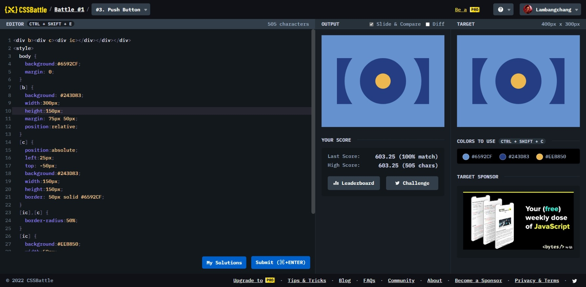

# Push Button



```html
<div id="b">
  <div id="oc">
    <div id="ic"></div>
  </div>
</div>

<style>
  body {
    background: #6592cf;
    margin: 0;
  }
  #b {
    width: 300px;
    height: 150px;
    background: #243d83;
    margin: 75px auto;
    position: relative;
  }
  #oc {
    position: absolute;
    background: #243d83;
    border: 50px solid #6592cf;
    width: 150px;
    height: 150px;
    top: -50px;
    left: 25px;
  }
  #ic {
    margin: 50px;
    width: 50px;
    height: 50px;
    background: #eeb850;
  }
  #ic,
  #oc {
    border-radius: 50%;
  }
</style>
```
