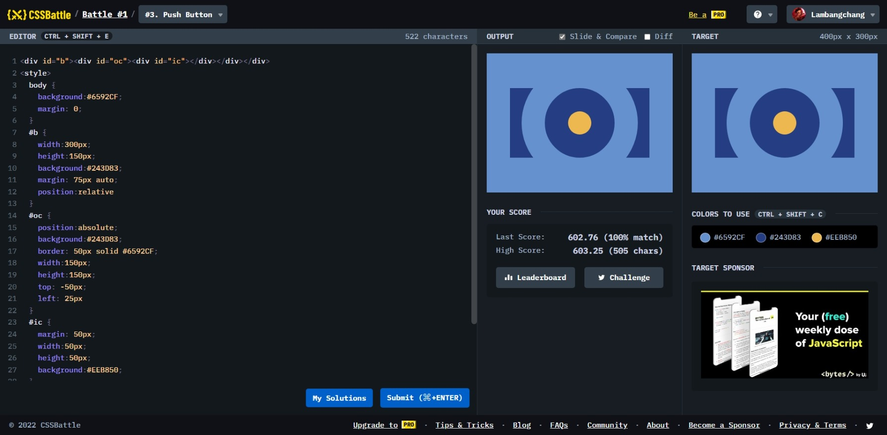

# Push Button


```html
<div b>
  <div c><div ic></div></div>
</div>
<style>
  body {
    background: #6592cf;
    margin: 0;
  }
  [b] {
    background: #243d83;
    width: 300px;
    height: 150px;
    margin: 75px 50px;
    position: relative;
  }
  [c] {
    position: absolute;
    left: 25px;
    top: -50px;
    background: #243d83;
    width: 150px;
    height: 150px;
    border: 50px solid #6592cf;
  }
  [ic],
  [c] {
    border-radius: 50%;
  }
  [ic] {
    background: #eeb850;
    width: 50px;
    height: 50px;
    margin: 50px;
  }
</style>
```
