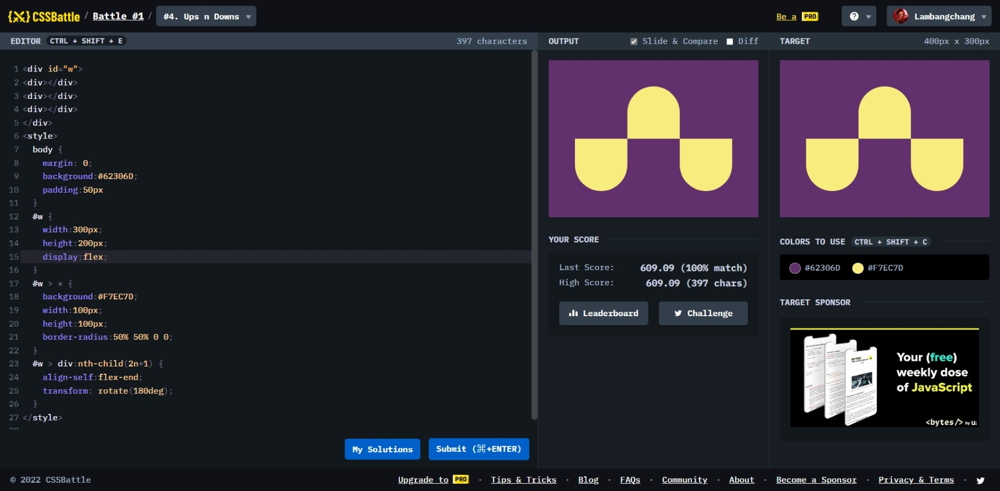

# Ups n Down

```html
<div w>
  <div b l></div>
  <div b c></div>
  <div b r></div>
</div>
<style>
  body {
    margin: 0;
    background: #62306d;
    display: flex;
    justify-content: center;
    align-items: center;
  }
  [w] {
    height: 200px;
    width: 300px;
    display: flex;
  }
  [b]:nth-child(2n + 1) {
    margin-top: 100px;
    transform: rotate(180deg);
  }
  [b] {
    background: #f7ec7d;
    width: 100px;
    height: 100px;
    border-radius: 50% 50% 0 0;
  }
</style>
```
