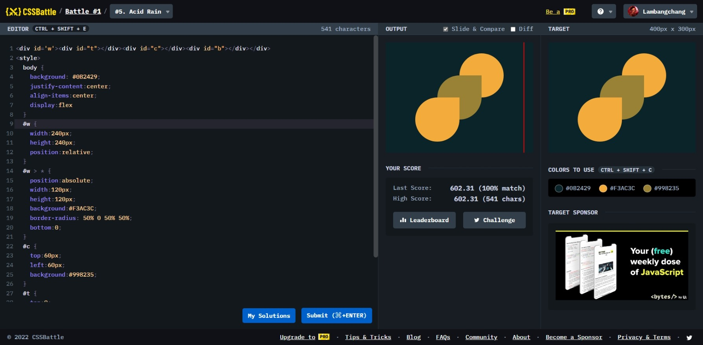

# Acid Rain



```html
<div id="w">
  <div id="t"></div>
  <div id="c"></div>
  <div id="b"></div>
</div>
<style>
  body {
    background: #0b2429;
    justify-content: center;
    align-items: center;
    display: flex;
  }
  #w {
    width: 240px;
    height: 240px;
    position: relative;
  }
  #w > * {
    position: absolute;
    width: 120px;
    height: 120px;
    background: #f3ac3c;
    border-radius: 50% 0 50% 50%;
    bottom: 0;
  }
  #c {
    top: 60px;
    left: 60px;
    background: #998235;
  }
  #t {
    top: 0;
    right: 0;
    transform: rotate(180deg);
  }
</style>
```
