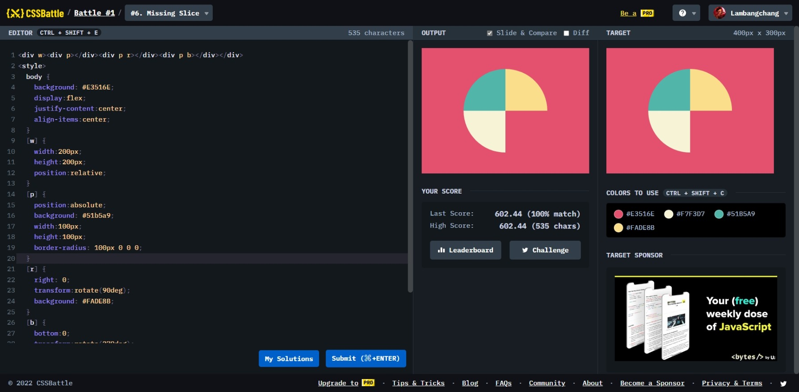

# Missing Slice



```html
<div id="b"></div>
<style>
  body {
    background: #e3516e;
    display: flex;
    justify-content: center;
    align-items: center;
  }
  #b {
    width: 200px;
    height: 200px;
    background: conic-gradient(
      #fade8b 90deg,
      #e3516e 90deg 180deg,
      #f7f3d7 180deg 270deg,
      #51b5a9 270deg
    );
    border-radius: 50%;
  }
</style>
```
