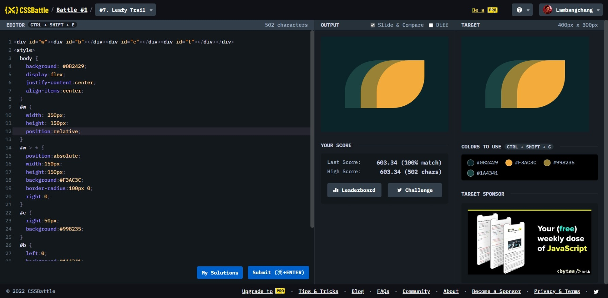

# Leafy Trial



```html
<div id="w">
  <div id="b"></div>
  <div id="c"></div>
  <div id="t"></div>
</div>
<style>
  body {
    background: #0b2429;
    display: flex;
    justify-content: center;
    align-items: center;
  }
  #w {
    width: 250px;
    height: 150px;
    position: relative;
  }
  #w > * {
    position: absolute;
    width: 150px;
    height: 150px;
    background: #f3ac3c;
    border-radius: 100px 0;
    right: 0;
  }
  #c {
    right: 50px;
    background: #998235;
  }
  #b {
    left: 0;
    background: #1a4341;
  }
</style>
```
