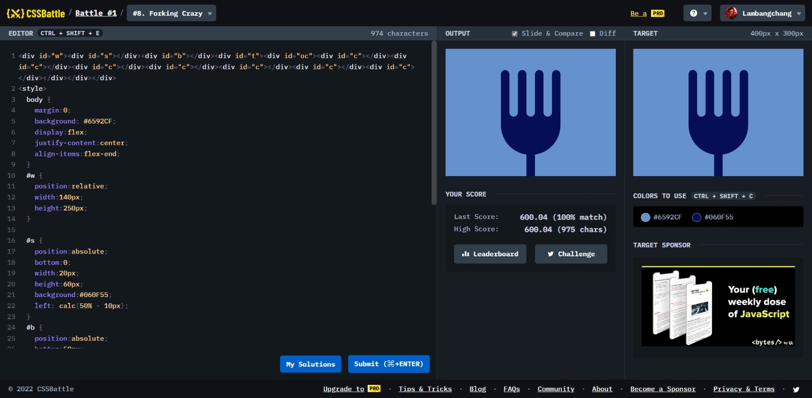

# Forking Crazy



```html
<div id="w">
  <div id="s"></div>
  <div id="b"></div>
  <div id="t">
    <div id="oc">
      <div id="c"></div>
      <div id="c"></div>
      <div id="c"></div>
      <div id="c"></div>
      <div id="c"></div>
      <div id="c"></div>
      <div id="c"></div>
    </div>
  </div>
</div>
<style>
  body {
    margin: 0;
    background: #6592cf;
    display: flex;
    justify-content: center;
    align-items: flex-end;
  }
  #w {
    position: relative;
    width: 140px;
    height: 250px;
  }

  #s {
    position: absolute;
    bottom: 0;
    width: 20px;
    height: 60px;
    background: #060f55;
    left: calc(50% - 10px);
  }
  #b {
    position: absolute;
    bottom: 50px;
    width: 140px;
    height: 100px;
    border-radius: 0 0 180px 180px;
    background: #060f55;
  }
  #oc {
    position: absolute;
    display: flex;
  }
  #c {
    width: 20px;
    height: 110px;
  }
  #c:nth-child(2n + 1) {
    background: #060f55;
    border-radius: 10px 10px 0 0;
  }
  #c:nth-child(2n) {
    background: #6592cf;
    border-radius: 0 0 10px 10px;
  }
</style>
```
