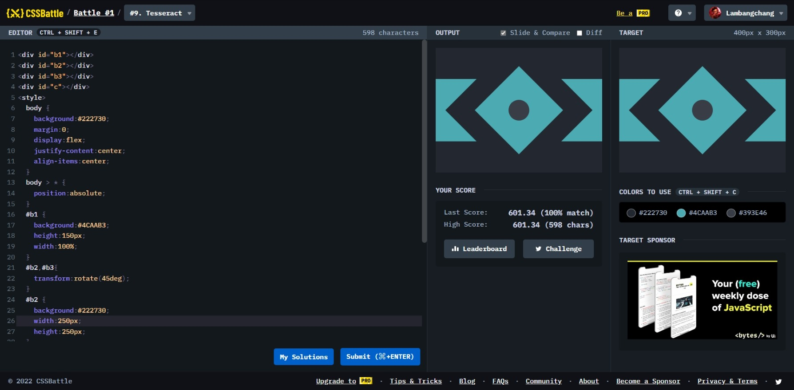

# Tesseract



```html
<div id="b1"></div>
<div id="b2"></div>
<div id="b3"></div>
<div id="c"></div>
<style>
  body {
    background: #222730;
    margin: 0;
    display: flex;
    justify-content: center;
    align-items: center;
  }
  body > * {
    position: absolute;
  }
  #b1 {
    background: #4caab3;
    height: 150px;
    width: 100%;
  }
  #b2,
  #b3 {
    transform: rotate(45deg);
  }
  #b2 {
    background: #222730;
    width: 250px;
    height: 250px;
  }
  #b3 {
    background: #4caab3;
    width: 150px;
    height: 150px;
  }
  #c {
    border-radius: 50%;
    width: 50px;
    height: 50px;
    background: #393e46;
  }
</style>
```
