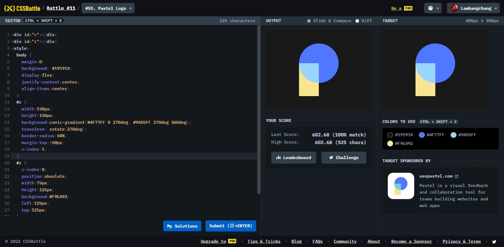

# Pastel Logo



```html
<div id="c"></div>
<div id="r"></div>
<style>
  body {
    margin: 0;
    background: #19191a;
    display: flex;
    justify-content: center;
    align-items: center;
  }
  #c {
    width: 150px;
    height: 150px;
    background: conic-gradient(#4f77ff 0 270deg, #9ad5ff 270deg 360deg);
    transform: rotate(270deg);
    border-radius: 50%;
    margin-top: -50px;
    z-index: 1;
  }
  #r {
    z-index: 0;
    position: absolute;
    width: 75px;
    height: 125px;
    background: #f9e492;
    left: 125px;
    top: 125px;
  }
</style>
```
