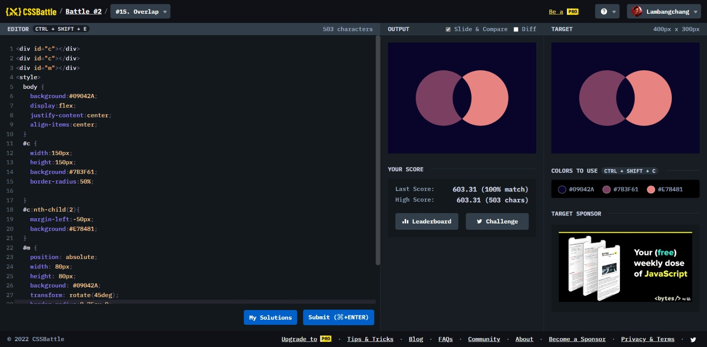

# Overlap



```html
<div id="c"></div>
<div id="c"></div>
<div id="m"></div>
<style>
  body {
    background: #09042a;
    display: flex;
    justify-content: center;
    align-items: center;
  }
  #c {
    width: 150px;
    height: 150px;
    background: #7b3f61;
    border-radius: 50%;
  }
  #c:nth-child(2) {
    margin-left: -50px;
    background: #e78481;
  }
  #m {
    position: absolute;
    width: 80px;
    height: 80px;
    background: #09042a;
    transform: rotate(45deg);
    border-radius: 0 75px 0;
  }
</style>
```
