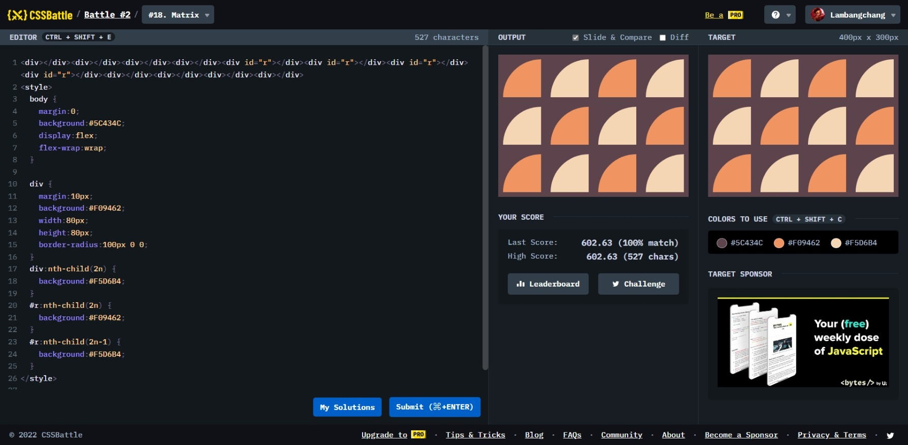

# Matrix



```html
<div></div>
<div></div>
<div></div>
<div></div>
<div id="r"></div>
<div id="r"></div>
<div id="r"></div>
<div id="r"></div>
<div></div>
<div></div>
<div></div>
<div></div>
<style>
  body {
    margin: 0;
    background: #5c434c;
    display: flex;
    flex-wrap: wrap;
  }

  div {
    margin: 10px;
    background: #f09462;
    width: 80px;
    height: 80px;
    border-radius: 100px 0 0;
  }
  div:nth-child(2n) {
    background: #f5d6b4;
  }
  #r:nth-child(2n) {
    background: #f09462;
  }
  #r:nth-child(2n-1) {
    background: #f5d6b4;
  }
</style>
```
