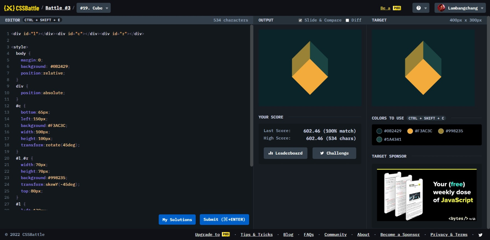

# Cube



```html
<div id="l"></div>
<div id="c"></div>
<div id="r"></div>

<style>
  body {
    margin: 0;
    background: #0b2429;
    position: relative;
  }
  div {
    position: absolute;
  }
  #c {
    bottom: 65px;
    left: 150px;
    background: #f3ac3c;
    width: 100px;
    height: 100px;
    transform: rotate(45deg);
  }
  #l,
  #r {
    width: 70px;
    height: 70px;
    background: #998235;
    top: 80px;
  }
  #l {
    transform: skewY(-45deg);
    left: 130px;
  }
  #r {
    background: #1a4341;
    transform: skewY(45deg);
    right: 130px;
  }
</style>
```
