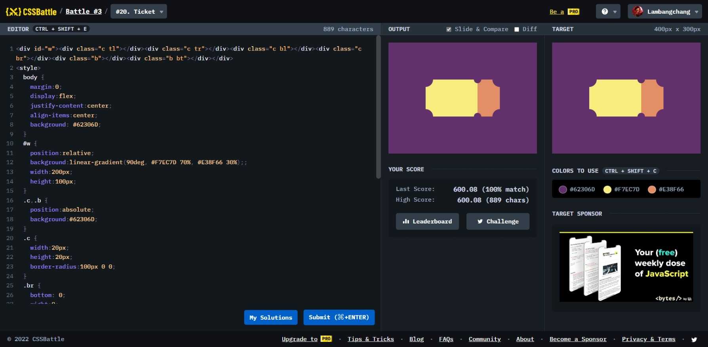

# Ticket



```html
<div id="w">
  <div class="c tl"></div>
  <div class="c tr"></div>
  <div class="c bl"></div>
  <div class="c br"></div>
  <div class="b"></div>
  <div class="b bt"></div>
</div>
<style>
  body {
    margin: 0;
    display: flex;
    justify-content: center;
    align-items: center;
    background: #62306d;
  }
  #w {
    position: relative;
    background: linear-gradient(90deg, #f7ec7d 70%, #e38f66 30%);
    width: 200px;
    height: 100px;
  }
  .c,
  .b {
    position: absolute;
    background: #62306d;
  }
  .c {
    width: 20px;
    height: 20px;
    border-radius: 100px 0 0;
  }
  .br {
    bottom: 0;
    right: 0;
  }
  .bl {
    bottom: 0;
    transform: rotate(90deg);
  }
  .tr {
    right: 0;
    transform: rotate(270deg);
  }
  .tl,
  .bt {
    transform: rotate(180deg);
  }
  .b {
    width: 20px;
    height: 10px;
    border-radius: 0 0 10px 10px;
    right: 50px;
  }
  .bt {
    bottom: 0;
  }
</style>
```
