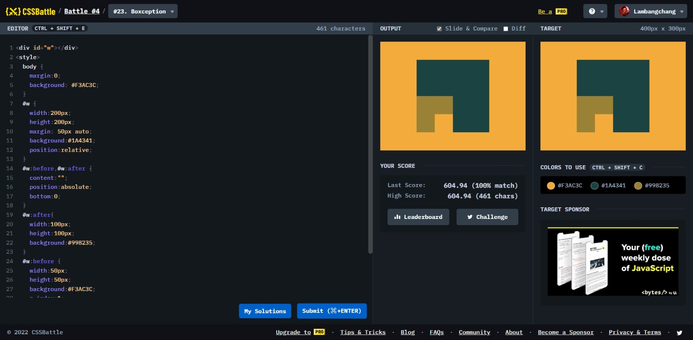

# Boxception



```html
<div id="w"></div>
<style>
  body {
    margin: 0;
    background: #f3ac3c;
  }
  #w {
    width: 200px;
    height: 200px;
    margin: 50px auto;
    background: #1a4341;
    position: relative;
  }
  #w:before,
  #w:after {
    content: "";
    position: absolute;
    bottom: 0;
  }
  #w:after {
    width: 100px;
    height: 100px;
    background: #998235;
  }
  #w:before {
    width: 50px;
    height: 50px;
    background: #f3ac3c;
    z-index: 1;
    left: 50px;
  }
</style>
```
