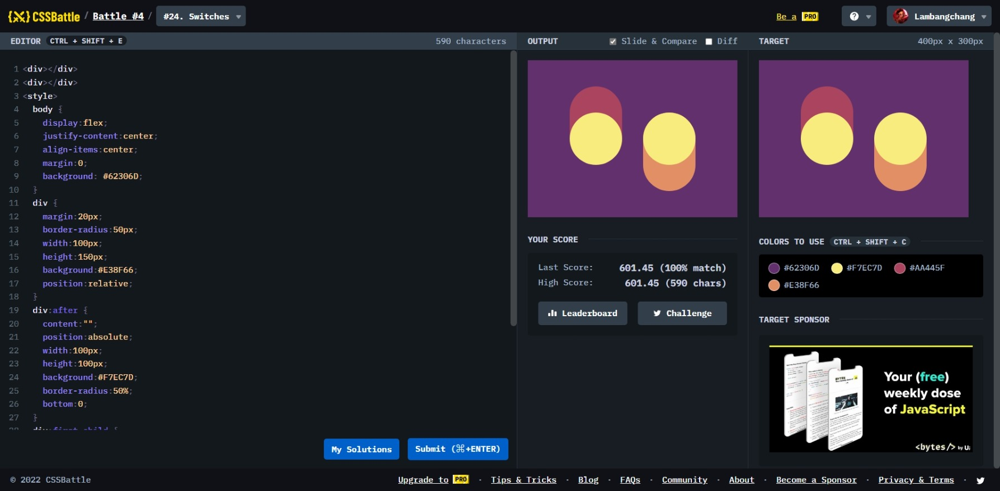

# Switches



```html
<div></div>
<div></div>
<style>
  body {
    display: flex;
    justify-content: center;
    align-items: center;
    margin: 0;
    background: #62306d;
  }
  div {
    margin: 20px;
    border-radius: 50px;
    width: 100px;
    height: 150px;
    background: #e38f66;
    position: relative;
  }
  div:after {
    content: "";
    position: absolute;
    width: 100px;
    height: 100px;
    background: #f7ec7d;
    border-radius: 50%;
    bottom: 0;
  }
  div:first-child {
    margin-top: -30px;
    background: #aa445f;
  }
  div:nth-child(2) {
    margin-top: 70px;
    transform: scaleY(-1);
  }
</style>
```
