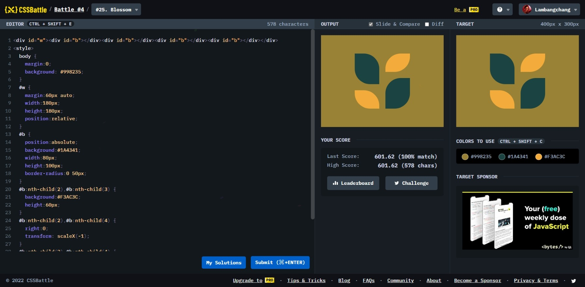

# Blossom



```html
<div id="w">
  <div id="b"></div>
  <div id="b"></div>
  <div id="b"></div>
  <div id="b"></div>
</div>
<style>
  body {
    margin: 0;
    background: #998235;
  }
  #w {
    margin: 60px auto;
    width: 180px;
    height: 180px;
    position: relative;
  }
  #b {
    position: absolute;
    background: #1a4341;
    width: 80px;
    height: 100px;
    border-radius: 0 50px;
  }
  #b:nth-child(2),
  #b:nth-child(3) {
    background: #f3ac3c;
    height: 60px;
  }
  #b:nth-child(2),
  #b:nth-child(4) {
    right: 0;
    transform: scaleX(-1);
  }
  #b:nth-child(3),
  #b:nth-child(4) {
    bottom: 0;
  }
</style>
```
