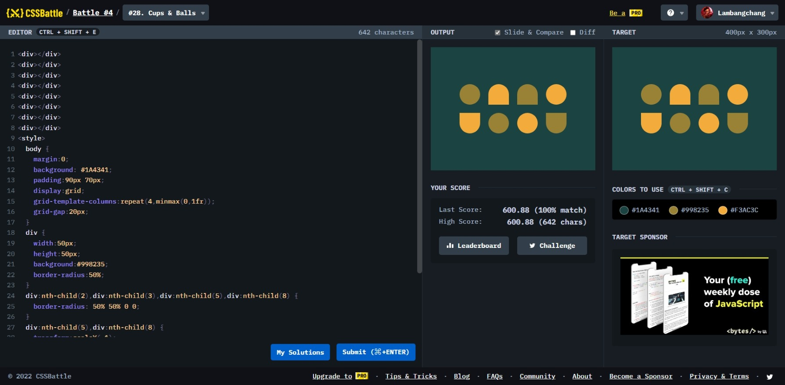

# Cups & Balls



```html
<div></div>
<div></div>
<div></div>
<div></div>
<div></div>
<div></div>
<div></div>
<div></div>
<style>
  body {
    margin: 0;
    background: #1a4341;
    padding: 90px 70px;
    display: grid;
    grid-template-columns: repeat(4, minmax(0, 1fr));
    grid-gap: 20px;
  }
  div {
    width: 50px;
    height: 50px;
    background: #998235;
    border-radius: 50%;
  }
  div:nth-child(2),
  div:nth-child(3),
  div:nth-child(5),
  div:nth-child(8) {
    border-radius: 50% 50% 0 0;
  }
  div:nth-child(5),
  div:nth-child(8) {
    transform: scaleY(-1);
  }
  div:nth-child(2),
  div:nth-child(4),
  div:nth-child(5),
  div:nth-child(7) {
    background: #f3ac3c;
  }
</style>
```
