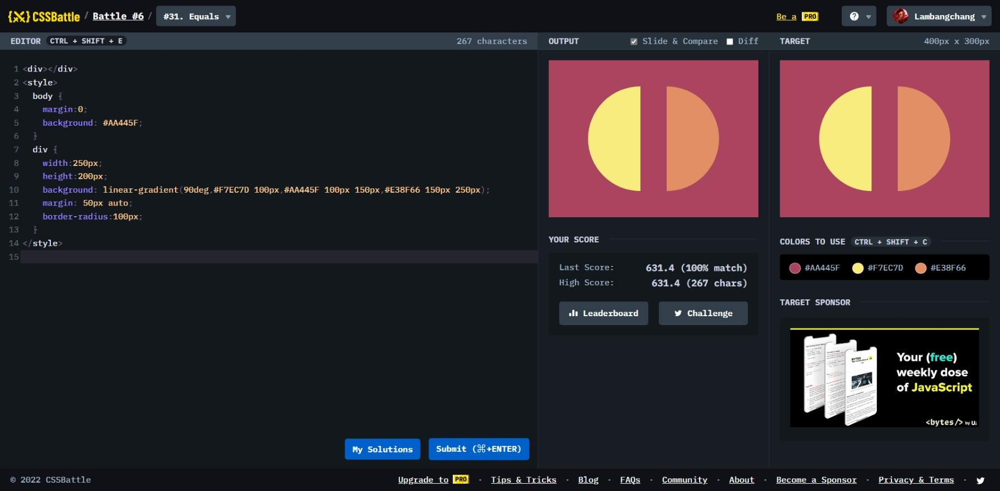

# Equals



```html
<div></div>
<style>
  body {
    margin: 0;
    background: #aa445f;
  }
  div {
    width: 250px;
    height: 200px;
    background: linear-gradient(
      90deg,
      #f7ec7d 100px,
      #aa445f 100px 150px,
      #e38f66 150px 250px
    );
    margin: 50px auto;
    border-radius: 100px;
  }
</style>
```
