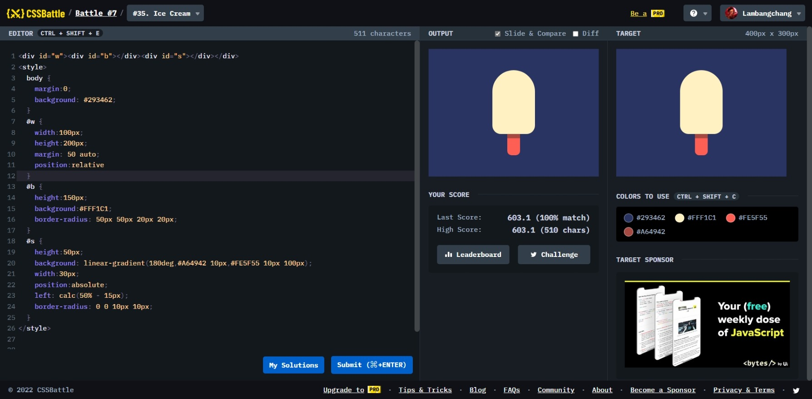

# Ice Cream



```html
<div id="w">
  <div id="b"></div>
  <div id="s"></div>
</div>
<style>
  body {
    margin: 0;
    background: #293462;
  }
  #w {
    width: 100px;
    height: 200px;
    margin: 50 auto;
    position: relative;
  }
  #b {
    height: 150px;
    background: #fff1c1;
    border-radius: 50px 50px 20px 20px;
  }
  #s {
    height: 50px;
    background: linear-gradient(180deg, #a64942 10px, #fe5f55 10px 100px);
    width: 30px;
    position: absolute;
    left: calc(50% - 15px);
    border-radius: 0 0 10px 10px;
  }
</style>
```
