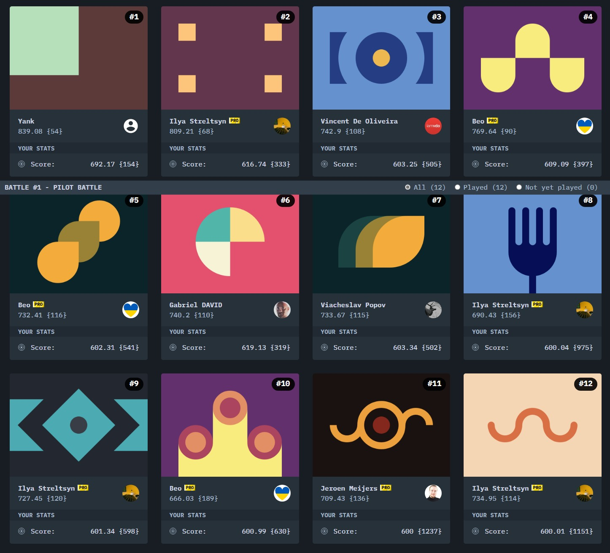
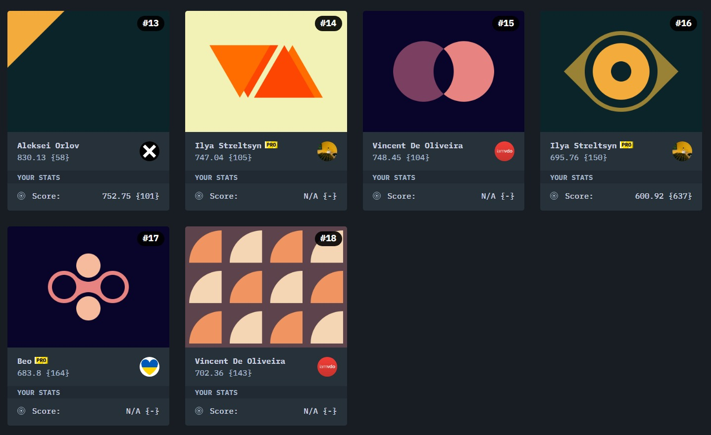
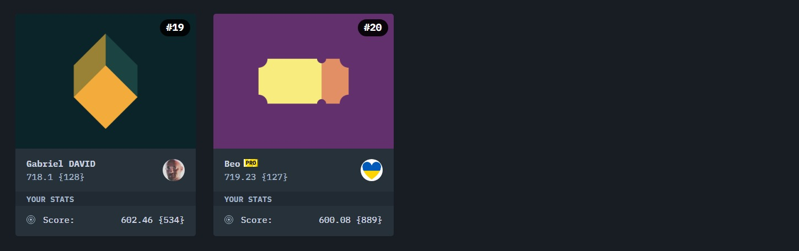
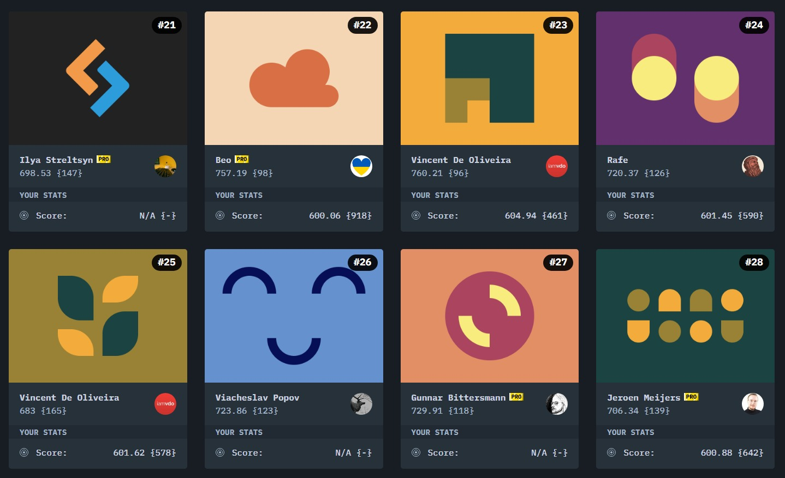
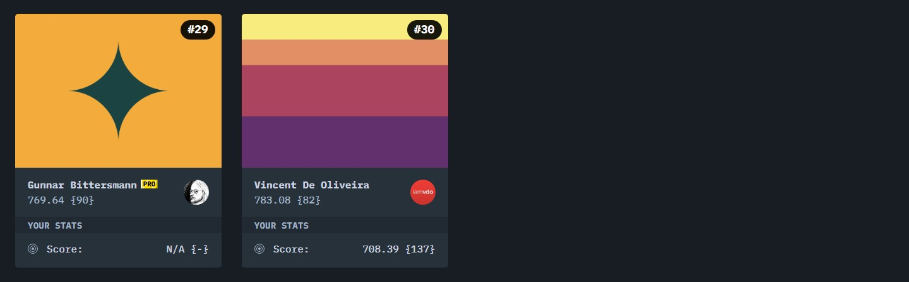
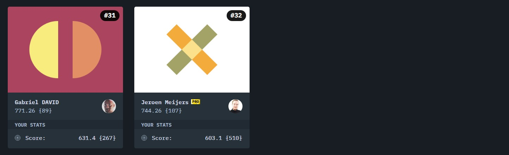

# CSS Battle

## Battle #1 - Pilot Battle

* [#1 - Simply Square](./1-Pilot-Battle/1-Simply-Square.md)
* [#2 - Carrom](./1-Pilot-Battle/2-Carrom.md)
* [#3 - Push Button](./1-Pilot-Battle/3-Push-Button.md)
* [#4 - Ups n Downs](./1-Pilot-Battle/4-Ups-n-Down.md)
* [#5 - Acid Rain](./1-Pilot-Battle/5-Acid-Rain.md)
* [#6 - Missing Slice](./1-Pilot-Battle/6-Missing-Slice.md)
* [#7 - Leafy Trail](./1-Pilot-Battle/7-Leafy-Trail.md)
* [#8 - Forking Crazy](./1-Pilot-Battle/8-Forking-Crazy.md)
* [#9 - Tesseract](./1-Pilot-Battle/9%3DTesseract.md)
* [#10 - Cloaked Spirits](./1-Pilot-Battle/10-Cloaked-Spirits.md)
* #11 - Eye of Sauron
* #12 - Wiggly Moustache

## Battle #2 - Visibility

* [#13 - Totally Triangle](./2-Visibility/13-Totally-Triangle.md)
* #14 - Web Maker Logo
* [#15 - Overlap](./2-Visibility/15-Overlap.md)
* [#16 - Eye of The Tiger](./2-Visibility/16-Eye-of-The-Tiger.md)
* #17 - Fidget Spinner
* [#18 - Matrix](./2-Visibility/18-Matrix.md)

## Battle #3 - Cursor

* [#19 - Cube](./3-Cursor/19-Cube.md)
* [#20 - Ticket](./3-Cursor/20-Ticket.md)

## Battle #4 - Display

* #21 - SitePoint Logo
* #22 - Cloud
* [#23 - Boxception](./4-Display/23-Boxception.md)
* [#24 - Switches](./4-Display/24-Switches.md)
* [#25 - Blossom](./4-Display/25-Blossom.md)
* #26 - Smiley
* #27 - Lock Up
* [#28 - Cups & Balls](./4-Display/28-Cups-%26-Balls.md)

## Battle #5 - Inline

* #29 - Suffocate
* [#30 - Horizon](./5-Inline/30-Horizon.md)

## Battle #6 - Conic

* [#31 - Equals](./6-Conic/31-Equals.md)
* [#32 - Band Aid](./6-Conic/32-Band-Aid.md)